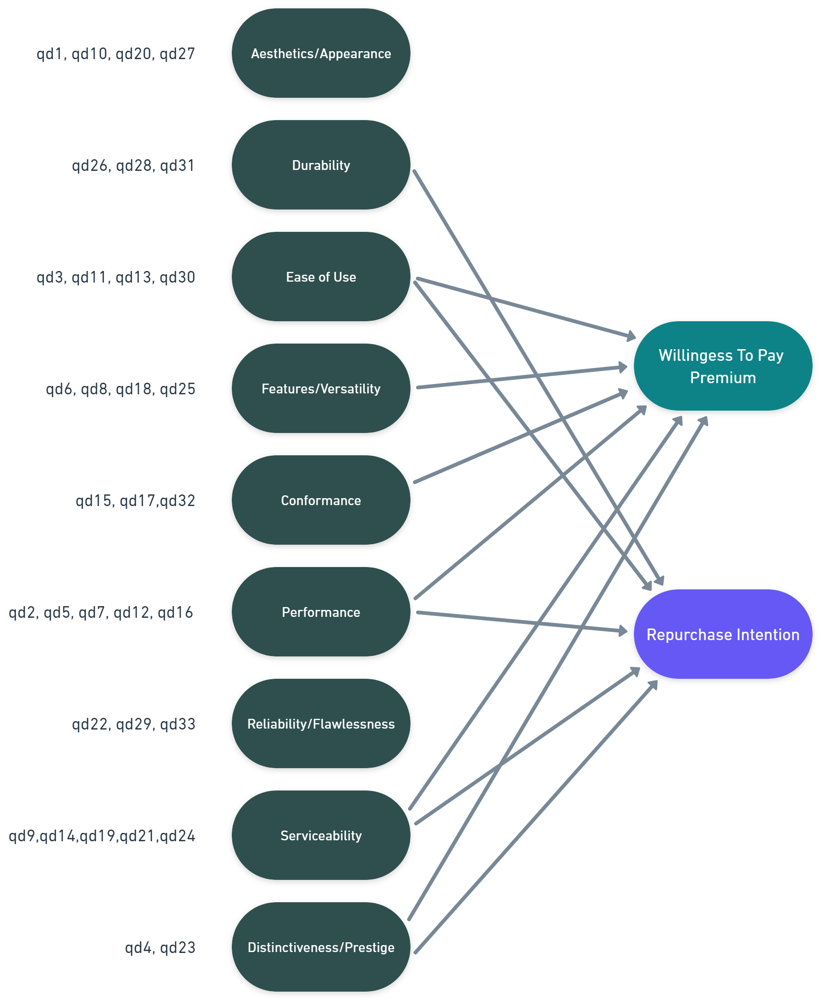

```{r setup, include=FALSE}

knitr::opts_chunk$set(
	message = FALSE,
	warning = FALSE,
	include = TRUE,
	fig.align = "center")
rm(list = ls())
cat("\014")

```

<break>

Goal: The goal of the research project discussed in the text is to develop a framework to measure product quality of smartphones as experienced by customers in terms of its constituent dimensions and to understand which quality dimensions significantly explain key outcome variables such as willingness to pay premium and repurchase intentions. We also will compare brand competitors in such factors and try to evaluate them with a common score scale. Thus, The goal of the project is to gain a deeper understanding of which quality dimensions significantly explain key outcome variables such as **willingness to pay premium** (**WTPP**) and **repurchase intentions** (**RI**) from customers. This information will be used by product management to improve the quality of their smartphones and enhance the company's competitive advantage in the marketplace.

# Packages {-}

In the following all the packages needed for this case study are loaded.

```{r packages}

library(ggplot2)
library(DT)
library(jtools)
library(kableExtra)
library(pastecs)
library(rcompanion)   #Histogram and Normal Curve
library(nortest) #Kolmogorov-Smirnov-Test
library(corrplot) #correlation matrix plot
library(olsrr)  #VIF and Tolerance Values
library(dplyr)
library(pastecs)
library(REdaS) #Bartelett's Test
library(psych)
library(lm.beta)
library(RColorBrewer)
library(tidyverse)
library(fastDummies)
library(GPArotation)

```

# Data {-}

The source is thereby listed below.

Source: **Advanced Data Driven Decision Making** [S401024](https://moodle.unige.ch/course/view.php?id=2675 "2675") - University of Geneva (GSEM)

Marcel Paulssen, Professor\
Fereshteh Vahidi, Teaching Assistant\
Anastasia Floru, Teaching Assistant

```{r data loading}
Mydata <- read.csv("DATA/Data File_Case_Study_Factor Analysis_MD.csv", header=TRUE)

# selecting questions
Mydata_with_y <- Mydata[,c(5, 9:41, 43:45, 51:52)]
Mydata_with_y <- na.omit(Mydata_with_y)
brands <- Mydata_with_y$brand
brands <- ifelse(brands == 1, "Apple",
              ifelse(brands == 2, "Samsung",
              ifelse(brands == 3, "LG",
              ifelse(brands == 4, "Motorola", "Other"))))
Mydata_with_y <- Mydata_with_y[,c(2:39)]
Mydata_qd <- Mydata_with_y[,1:33]
rm(Mydata)
```

## Data Analysis

Here we look for Na's in the data.

```{r, include=FALSE}
list_na =colnames(Mydata_with_y)[apply(Mydata_with_y,2,anyNA)]
list_na
```

We see that there are none so we can continue with our Analysis without a problem.

## Data Statistics Summary

To get an overview of the data we use a describing function

```{r}

Stat_Desc <- stat.desc(Mydata_with_y, norm=TRUE)

DT::datatable(round(Stat_Desc,3))

```


There is no missing values, kurtosis and skewness are relatively smalls, but kurtosis shows slight flat distributions. The skewness being often negative shows right skewed distribution of the data.

> Comments: We can see that we have 969 observations for 33 questions (covariates), meaning we are above the required rule of thumb by **Frank Harrell's book, Regression Modeling Strategies** which states that for each covariate, 10-20 observations are needed. We would need 33x10 = 330 observations or 33x20 = 660 observations, and have way above with 969 observations [330 or 660 required]. None of the covariates are behaving normally.  

## Histograms

We can see the normality not full-filled visually as well.

```{r}

plotNormalHistogram(Mydata_with_y$qd1,main = paste("Frequency Distribution of qd1"))

```

## Normality Test on Y

To see if the y's are normally distributed we do a lillie.test on them.

```{r}
lillie.test(Mydata_with_y$wtp1)
lillie.test(Mydata_with_y$wtp2)
lillie.test(Mydata_with_y$wtp3)
lillie.test(Mydata_with_y$ri1)
lillie.test(Mydata_with_y$ri2)
```

As we can see none of the response variables behave normally.

## Correlation Plot

Next we do a correlation plot over all of the questions.  

```{r}

cor_mat <- cor(Mydata_with_y)

corrplot(as.matrix(cor_mat), method="color",type="upper", order="hclust", tl.col="black", tl.srt=45,tl.cex = 0.5, diag=FALSE, sig.level=001)

```

We can see that some questions have high correlations between them, but most of them being correlated positively between 0.4 and 0.6.

# Multiple Linear Regression on All Covariates

In this part we fit a multiple linear regression on the data and do the necessary analysis.

## Compute mean scores for the three willingness to pay premium items (wtp1-wtp3) and the two repurchase intention items (ri1-ri2)

To do so we need to calculate the average of the WTP and the RI items.

```{r}
Mydata_with_y$avg_wtp <- apply(Mydata_with_y[,34:36], 1, 'mean')
Mydata_with_y$avg_ri <- apply(Mydata_with_y[,37:38], 1, 'mean')
```

## Tolerance Value and VIF

Next we look at the variable importance of each question for every dependent variable.

### Willingness To Pay Premium

Here we fit the model of willingness to pay premium and do the variable importance.

```{r}
model_wtp <- lm(avg_wtp ~., data = Mydata_with_y[c(1:33,39)])
ols_vif_tol(model_wtp)
```

The VIF are under control, with no values higher than 10.

### Repurchase Intention

Here we to the same thing for the repurchase intention. 

```{r}
model_ri <- lm(avg_ri ~., data = Mydata_with_y[c(1:33,40)])
ols_vif_tol(model_ri)
```


The VIF are under control, with no values higher than 10. Thus we shouldn't worry to much of the multicolinearity problem.

## Residuals

Now we look at the residuals of the WTP and RI.

### Willingness to Pay Premium

Down below is the residual analysis for WTP. 

```{r}

par(mfrow = c(2, 2))
plot(model_wtp)

```

As we can see, the normality and homoskedasticity of the linear regression are not full-filled, seeing some patterns in the scale-location plot as well as out of place residuals in the Normal Q-Q on both sides of the plot.

### Repurchase Intention

```{r}

par(mfrow = c(2, 2))
plot(model_ri)

```

As we can see, the normality and homoskedasticity of the linear regression are not full-filled, seeing some strong patterns in the scale-location plot as well as out of place residuals in the Normal Q-Q on both sides of the plot. This model for **Repurchase Intention** is way worse than the **Willingness to Pay**.

## Multiple Linear Regression

Now we fit the multiple linear regression for WTP and RI

### Willingness to Pay

Down below we fit the model for the WTP.

```{r}
model_wtp <- lm(avg_wtp ~., data = Mydata_with_y[c(1:33,39)])
model_wtp_beta=lm.beta(model_wtp)
summary(model_wtp_beta)
```
The adjusted R-squared is very low, thus only 39.7% of the variance on our depend variable is explained by the covariates, but the F-statistic is significant, showing that the covariates are indeed explaining something in the relation to **Willingness to Pay**. Variables qd23, qd5 and qd1 are significants at 1%, and qd23 being the most strongest predictive one.

### Repurchase Intention

And here we fit it for RI. 

```{r}
model_ri <- lm(avg_ri ~., data = Mydata_with_y[c(1:33,40)])
model_ri_beta=lm.beta(model_ri)
summary(model_ri_beta)
```

The adjusted R-squared is very low, thus only 45% of the variance on our depend variable is explained by the covariates, but the F-statistic is significant, showing that the covariates are indeed explaining something in the relation to **Repurchase Intention**. Variables qd30, qd23, qd18 and qd5 are significant (at different alpha level: 1% and 5%), and qd5 being the most strongest predictive one.

# Orthogonal Factor Analysis

In this part we will do all the necessary steps needed for an orthogonal factor analysis. 

## Anti-image correlation, Kaiser-Meyer-Olkin and Bartlett's test

First of all one needs to check the suitability of the data before doing any factor or principal component analysis. 

### Anti-image Correlation

The anti-image correlation is a measure to see if the sample adequacy is enough for every variable. For this we run KMOS on the data. 

```{r}
KMOTEST=KMOS(Mydata_qd)
sort(KMOTEST$MSA)
```

All values are above 0.6 so a good factor analysis can be done. Only one value is close to not being good enough which is qd4 = 0.64. All the others are over 0.9.

### Kaiser-Meyer-Olkin

The Kaiser-Meyer-Olkin test is just the summary statistic of the anti-image correlation. As our test beforehand was good we should expect this one to be good as well. 

```{r}
KMOTEST=KMOS(Mydata_qd)
KMOTEST$KMO
```

The Kaiser-Meyer-Olkin criterion suggest that the adequacy of the data is marvelous (>0.9), which means we can use Factor Analysis.

### Bartlett's test

The bartlett's test test for correlation in the data which is needed for a factor analysis. 

```{r}
bart_spher(Mydata_qd)
```

There is a correlation between variables. since we reject the H0 hypothesis (which is the identity matrix), and the assumptions are not met since we have above 5 variables (this test shouldn't be used normally).

## Principal axes factoring with varimax

As the data past all the needed checks we can now do a factor analysis. 

```{r, results=FALSE}

fa_result <- fa(Mydata_qd, rotate = "varimax", fm = "pa")

plot(fa_result$e.values,xlab="Factor Number",ylab="Eigenvalue",main="Scree plot",cex.lab=1.2,cex.axis=1.2,cex.main=1.8)+abline(h=1)

factors_kaiser <- sum(fa_result$e.values>1)

```

Kaiser criterion gives `r factors_kaiser` factors, scree-test gives 10. From literature we know that there should be 9 factors. We first do a factor analysis with 8 factors to see if it makes sense.

### 8 Factors Loadings

Here we run the factor analysis according to the kaiser criterion with `r factors_kaiser` Factors. 

```{r}
fa_result_8 <- fa(Mydata_qd, rotate = "varimax", fm = "pa", nfactors = 8)
print(fa_result_8$loadings, cutoff=0.3,sort=TRUE)
```

We see that every question is loaded in a factor except for the question 4 and 23. We get similar results when we look at the communalities.

### 8 Factors Communalities

Here we show the communalities of the factor analysis with `r factors_kaiser` factors. 

```{r}
FA_communalities_8=data.frame(sort(fa_result_8$communality))
problematic_communalities_8 <- rownames(FA_communalities_8)[FA_communalities_8<0.5]
problematic_communalities_8
```

We see that there are two communalities which are below 0.5. They are fittingly for qd4 and qd23.

### 9 Factors Loadings

As by literature there are 9 factors we rerun the factor analysis to see the loadings for 9 factors.

```{r}
fa_result_9 <- fa(Mydata_qd, rotate = "varimax", fm = "pa", nfactors = 9)
print(fa_result_9$loadings, cutoff=0.3,sort=TRUE)
```

We can observe that the loadings for factor 9 are solely based on question 4 and question 23. We rerun the communalities.

```{r}
FA_communalities_9=data.frame(sort(fa_result_9$communality))
problematic_communalities_9 <- rownames(FA_communalities_9)[FA_communalities_9<0.5]
problematic_communalities_9
```

Again we see that question **4** and **23** are problematic. To see if we should exclude them we look at the questionnaire. Both question related to prestige therefore we leave them in and factor 9 is **Prestige**.

## Factors Labels based on Literature

Here we label the factors retrieved from our analysis according to the literature. 

```{r}

colnames(fa_result_9$loadings) <- c("Serviceability","Performance","Aesthetics_Appearance","Ease_of_Use","Reliability_Flawlessness","Features_Versatility","Conformance","Durability","Distinctiveness_Prestige")

print(fa_result_9$loadings, cutoff=0.3,sort=TRUE)

```

We see that there are in total 9 factors as supposed by literature. 

## Do all variables show clear loading patterns?

Yes they do. Question 8 is the only one which has a loading on an other factor as well that is higher than 0.3. Question 8 is related to having extra-features and if they do work, which is why it makes sense to see both **Performance** and **Features-Versality** together.

## Principal component analysis

Here we run a principal component analysis.

```{r}
PC1 <- principal(Mydata_qd, rotate = "varimax", nfactors = 9)

colnames(PC1$loadings) <- c("Serviceability","Performance","Aesthetics_Appearance","Ease_of_Use","Features_Versatility","Reliability_Flawlessness","Conformance","Durability","Distinctiveness_Prestige")

print(PC1$loadings,cutoff = 0.3,sort=TRUE)
```

Comparing the results we see that the pca and fa deliver similar results. Every question is assigned to the same factor. The only thing that varies are the loading's themselves.

We rerun the communalities for the principal compoent analysis. 

```{r}
PC_communalities_9=data.frame(sort(PC1$communality))
problematic_communalities_9 <- rownames(PC_communalities_9)[PC_communalities_9<0.5]
problematic_communalities_9
```

We see that there are no communalities below 0.5. 

## Differences between Factor Analysis and Principal Component Analysis

There are differences in the loadings value (very slightly up to 2 decimals), but the factors are the same with the same questions pattern. It is also observable that now there are no communalities which are below 0.5, So it assures us that we made the right decision before to run with 9 factors instead of 8. Principal component analysis may be better then because the theoretical factors are better differentiated. This is why we will continue with PCA in the remainder of this exercise.

## What do the eigenvalues of the factors/quality dimensions tell us about their relevance for repurchase behaviour?

SS loadings from the above output refers to the Eigenvalues of our Factors, thus we can keep only the one having Eigenvalues > 1, which would keep all of them, but we still see that Factor **Distinctiveness_Prestige** has eigenvalue of 1.2 which is close to 1.

The eigenvalues of the questions tell us how much variance is explained by the variables. The bigger the eigenvalue, the bigger the explained variance. To showcase this we show the eigenvalues of the principal component analysis and how much variance is explained by them.

### Eigenvalues of Questions

Here we see the eigenvalues of the questions and how much variance they explain. 

```{r}
EigenValue=PC1$values
Variance=EigenValue/ncol(Mydata_qd)*100
SumVariance=cumsum(EigenValue/ncol(Mydata_qd))
Total_Variance_Explained=cbind(EigenValue=EigenValue[EigenValue>0],Variance=Variance[Variance>0],Total_Variance=SumVariance[Variance>0])
Total_Variance_Explained
```


# **Oblique Factor analysis**

In the following part we will use one of the method above, between **Factor Analysis** or **PCA**. Since we got better results in **PCA**, we will use **Promax** Rotation in the **PCA** to compute the score.

```{r}
promax <- principal(Mydata_qd, oblique.scores = TRUE, rotate = 'promax', nfactors = 9)
colnames(promax$loadings) <- c("Serviceability","Performance","Aesthetics_Appearance","Ease_of_Use","Features_Versatility","Conformance","Reliability_Flawlessness","Durability","Distinctiveness_Prestige")

print(promax$loadings,cutoff = 0.3,sort=TRUE)
```

```{r}
structure <- promax$Structure # correlation
pattern <- promax$loadings # weights
```

```{r}
Scores <- promax$scores
colnames(Scores) <- c("Serviceability","Performance","Aesthetics_Appearance","Ease_of_Use","Features_Versatility","Conformance","Reliability_Flawlessness","Durability","Distinctiveness_Prestige")
```

## How high are the factors correlated and what is the highest correlation between factors. What does this mean – please explain

```{r}

cor_mat2 <- cor(Scores)
corrplot(as.matrix(cor_mat2), method="color",type="upper", order="hclust", tl.col="black", tl.srt=45,tl.cex = 0.5, addCoef.col = "black", diag=FALSE, sig.level=001)

```

The highest correlation between Factors is between **Performance** and **Features_Versatility**, which was expected since question 8 has both loading in the PCA loadings with varimax rotation. Overall, most factors are correlated with values in between 0.37 and 0.67, except for **Distinctiveness_Prestige**, which seems not correlated at all with other Factors. If the correlation matrix showed high correlation between Factors, our following attempt to compute a Multiple Linear Regression model would easily fail, because of Multi-linearity issues, and may show over-fit to the model.


## Compute factor scores for your factors and name and label them appropriately

```{r}

DT::datatable(Scores)

```

## Compute mean scores for the three **willingness to pay** premium items (wtp1-wtp3) and the two **repurchase intention** items (ri1-ri2).

```{r}

DT::datatable(round(Mydata_with_y[34:40],2))

```

## Run a regression analysis with the factor scores of the quality dimensions as independent and both the mean score of willingness to pay premium and repurchase intention as dependent variables

```{r}
Mydata_lm <- data.frame(Scores, Mydata_with_y[, 39:40])
WTP_Model <- lm(avg_wtp ~., Mydata_lm[,-11])
RI_Model <- lm(avg_ri ~., Mydata_lm[,-10])
```


### Willingess To Pay Model

```{r}

summ(WTP_Model)

```

The following Factors are significant: **Serviceability**, **Performance**, **Ease_of_Use**,**Features_Versatility**,**Conformance**, **Distinctiveness_Prestige** at 1% level (99% Confidence Interval). R^2 Adjusted is equal to 0.39, which means we don't explain a lot of the variance in our dependent variable **Willingess to Pay (AVG)**. The F-Test is significant, H0 which says that no connection between the DVs and the IVs can be thus rejected.

#### Residuals Analysis

```{r}

par(mfrow = c(2, 2))
plot(WTP_Model)

```


### Repurchase Intention

```{r}

summ(RI_Model)

```
The following Factors are significant: **Serviceability**, **Performance**, **Ease_of_Use**,**Durability**,**Distinctiveness_Prestige** at 1% level (99% Confidence Interval). R^2 Adjusted is equal to 0.44, which means we don't explain a lot of the variance in our dependent variable **Repurchase Intention (AVG)** but slightly more than the other dependent variable model (**WTP**). The F-Test is significant, H0 which says that no connection between the DVs and the IVs can be thus rejected.

#### Residuals Analysis

```{r}

par(mfrow = c(2, 2))
plot(RI_Model)

```

## Interpret your results from a managerial perspective

### Willingess to Pay (WTP)

The following Factors are given in descending order of their predictive power (coefficient), the most predictive power in the Willingness to Pay Premium to the Customers of Smartphones and thus must be targeted first to get more Willingness to Pay Premium from Customers.

1. **Ease_of_Use**
2. **Features_Versatility**
3. **Distinctiveness_Prestige**
4. **Serviceability**
5. **Performance**
6. **Conformance**

### Repurchase Intention (RI)

The following Factors are given in descending order of their predictive power (coefficient), the most predictive power in Repurchase Intention to the Customers of Smartphones and thus must be targeted first to get more Repurchase Intention from Customers.

1. **Performance**
2. **Ease_of_Use**
3. **Distinctiveness_Prestige**
4. **Durability**
5. **Serviceability**


<center>




</center>

## Do the results of the regression analysis for repurchase intentions differ across brands e.g. Samsung versus Apple versus LG

```{r}
Mydata_lm_2 <- data.frame(Scores, Mydata_with_y$avg_ri, brands)
Mydata_lm_2 <- dummy_cols(Mydata_lm_2, select_columns = 'brands', remove_selected_columns = TRUE, remove_first_dummy = TRUE)

RI_Brand_Model <- lm(Mydata_with_y.avg_ri ~ ., Mydata_lm_2)

summ(RI_Brand_Model)
```

The results of the regression analysis for repurchase intentions do differ across brand (The brand reference in this regression is **Apple**), since our coefficients are significant and differ from 0 (except **Motorola** which is not significant). Since all brands have negative coefficient, we can conclude that Apple Customer are more willing to repurchase than other customers (across other brands). The F-Test is significant, H0 which says that no connection between the DVs and the IVs can be thus rejected. R^2 Squared is better than the previous different model we did until now, with value of 0.52.


## Please compare the brands on the Factor Scores and point out the differences

Down below we calculate the mean of the factor scores per brand.

```{r}
Mydata_brands <- data.frame(Scores, brands)
Brands_Scores_Factors <- aggregate(Mydata_brands[,1:9], by = list(Mydata_brands$brands), mean)
colnames(Brands_Scores_Factors)[1] <- c("Brands")
Brands_Scores_Factors <- Brands_Scores_Factors %>%                   # Using dplyr functions
  mutate_if(is.numeric,
            round,
            digits = 2)

DT::datatable(Brands_Scores_Factors)
```

We see that **Apple** is the only brand that has a positive score for all of the factors. It might not always have the highest score but it is consistently good in every sector. For example **Motorola** is better in the serviceability of their phones but lacks in the aesthetics and appearance. It is also observable that the other phone brands as well as LG are way behind and get a negative score on all the factors. Also **Samsung** seems to be way of as they have negative scores on everything except for reliability where they are still behind apple. The only brand that outperforms **Apple** in some categories is **Motorola**. They beat **Apple** in Serviceability and Features and visibility. So in general it can be said that **Apple** is clearly the winner in this comparison and is way ahead of its competitors.


# References

[factor analysis: a short introduction, part 1](https://www.theanalysisfactor.com/factor-analysis-1-introduction/#:~:text=The%20eigenvalue%20is%20a%20measure,than%20a%20single%20observed%20variable.)

[https://lhbikos.github.io/ReC_Psychometrics/PCA.html](https://lhbikos.github.io/ReC_Psychometrics/PCA.html)

[Multivariate Multiple Linear Regression](https://www.statstest.com/multivariate-multiple-linear-regression/)

[Tools for summarizing and visualizing regression models](https://cran.r-project.org/web/packages/jtools/vignettes/summ.html)

[Round Numeric Columns of Data Frame with Character & Factor Variables in R (2 Examples)](https://statisticsglobe.com/round-numeric-columns-of-data-frame-in-r)